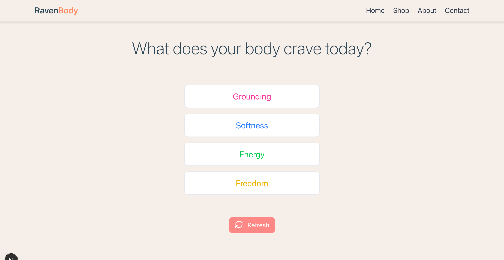

# React TypeScript Project

## Overview

This React(NextJS) TypeScript application, developed for the Bella Oter frontend assessment, showcases my frontend development skills. It presents a responsive Raven Body Profile experience page for selecting fabrics based on customers' mood.

## Profile Experience Page Snapshot

Here is a snapshot of the page implemented:



## Features

- **Responsive Design**: Built using Mobile-first design approach and adapts well to various screen sizes.
- **Mock Data**: Mock data was used without API calls.

## Technologies Used

- **Framework**: NextJS 14 (App Router)
- **Language**: TypeScript
- **Styling**: TailwindCSS
- **SVG Icons**: Custom SVG icons created and used
- **Linting**: ESLint + Prettier
- **Git Hooks**: Husky

### Requirement

- Node.js v18+
- npm
- Git

## Installation

To run this application locally on your machine, follow these steps:

1. Clone the repository:

```
git clone https://github.com/duokobia/raven-body.git
cd raven-body
```

2. Install dependencies:

```
npm install
```

3. Start the development server:

```
npm run dev
```

4. Open your browser by navigating to `http://localhost:3000` to view the application.

## Project Structure

The project structure is organized as follows:

```
raven-body/
├── husky/                  # Git hooks configuration
│   └── (other pages)
├── app/                    # Next.js App Router
│   ├── components          # Reusable UI components
│   ├── data                # Product data
│   └── type                # Type
|   ├── global.css          # Global CSS & Tailwind imports
|   ├── layout.tsx          # Root layout component
│   └── page.tsx            # Home page
├── public/
│   └── images              # Images
├── gitignore               # Git files to be ignored configured here
├── prettierrc              # Prettier configuration
├── eslint.config.ts        # Eslint configuration
├── ...                     # Other files
├── package-lock.json       # Detailed dependency tree snapshot 
├── package.json            # Packages and scripts used configuration
├── postcss.config.js       # PostCSS configuration
├── README.md               # Current file
├── tailwind.config.ts      # Tailwind CSS configuration
└──  tsconfig.json          # TypeScript configuration
```


## Time Spent
Approximately three hours was spent implementing my ideas and writing documentation for this application.

## Area for Improvement
Given the brand style guide, I would customize the page to make it look at exactly as designed. This includes colours, typography, etc. This would make the application look more professional. I will also animate the question on the page to scroll in. Effects that will make the page more interactive would be added as well. The state management when the page is refreshed would be better handled. 

## Acknowledgments

- I extend my deepest thanks to the Bella Oter team for affording me this opportunity to demonstrate my frontend development capabilities. I would also like to acknowledge the creators of NextJS, TypeScript, Tailwind CSS, and the other libraries that were instrumental in the successful completion of this project.
